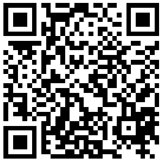

Eine Adresse ist eine Zeichenfolge aus Buchstaben und Zahlen, die du benutzen kannst um [Bitcoin](../b/bitcoin) zu empfangen. Du kannst sie in etwa mit der IBAN im Bankensystem vergleichen.

Im Gegensatz zum Bankkonto kann ein [Wallet](../w/wallet) jedoch beliebig viele verschiedene Adressen enthalten und du kannst jederzeit neue Adressen generieren.

Eine Adresse sieht beispielsweise so aus:

> bc1qwl7yeccraxvrk37m2umzlsywx5dvpung8cx487

Häufig werden Adressen in Form eines QR Codes ausgetauscht, die z.B. mit Smartphone [Wallets](../w/wallet) einfach gescannt werden können.

Dies ist der QR Code zur Beispieladresse:

Es gibt verschiedene Adressformate:

- Legacy & SegWit

  Legacy Adressen beginnen mit der Zahl **1**, Segwit mit der Zahl **3**. Es wird davon abgeraten diese veralteteten Formate zu benutzen, da die [Transaktionsgebühren](../t/transaktionsgebuehr) höher sind.

- Native SegWit

  Native SegWit Adressen beginnen mit **bc1q**. Sie sind der aktuelle Standard.

- Taproot

  Taproot Adressen beginnen mit **bc1p**. Sie sind das neueste Format, werden aber erst von wenigen [Exchanges](../e/exchange) unterstützt.
